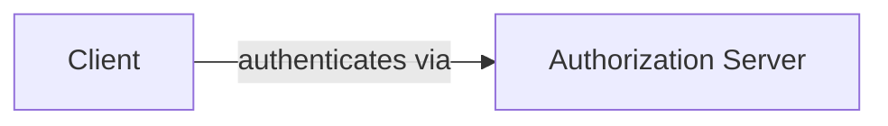
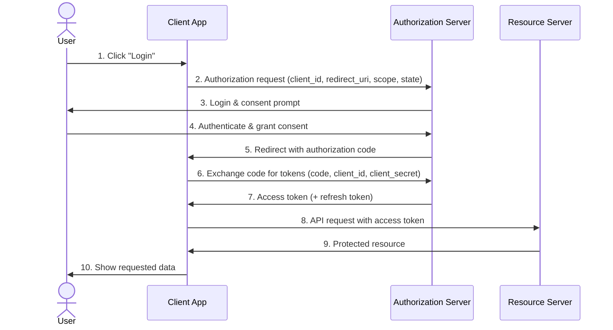

# This is a test PRD

This is a cool test as well

# Hello World ..

## Standard OAuth 2.0 Authorization Code Flow

> **Security note:** the code-for-tokens exchange in step 6 uses the `client_secret` and must only happen server-side — never expose the secret in browser or mobile code. Public clients should use PKCE instead.
